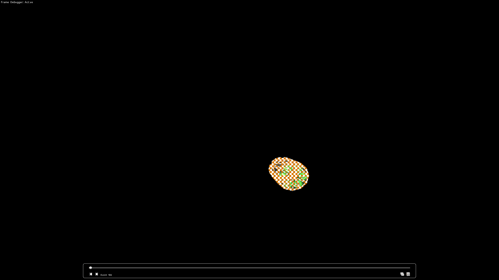
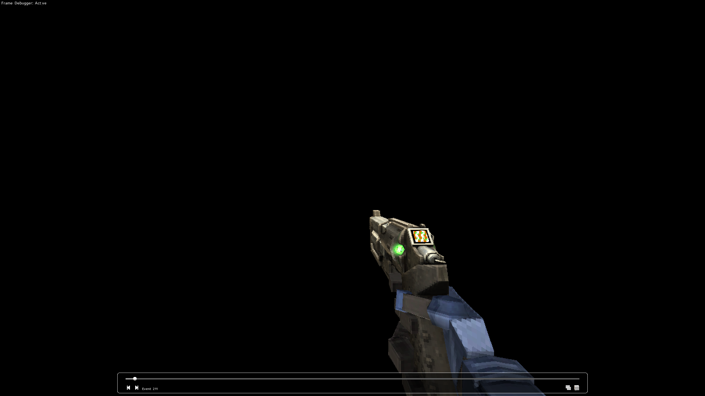
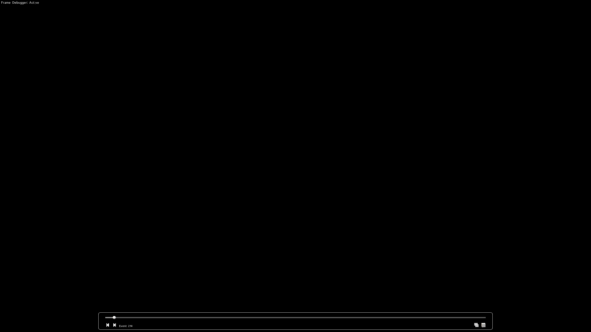
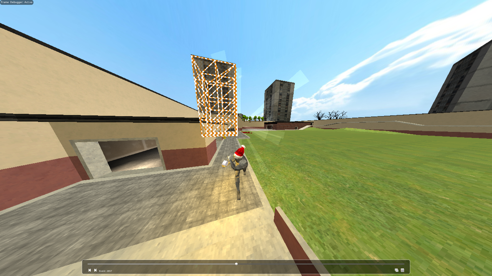
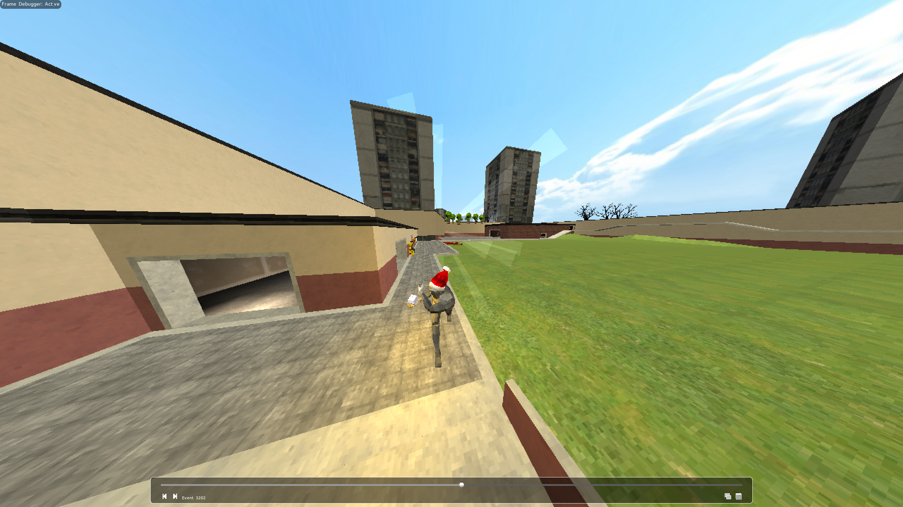
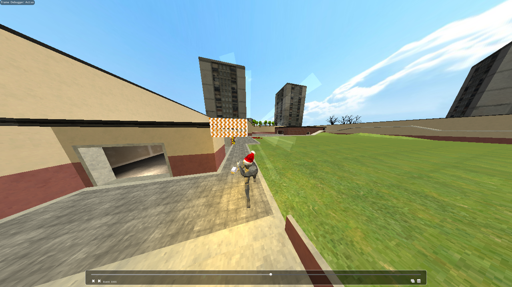
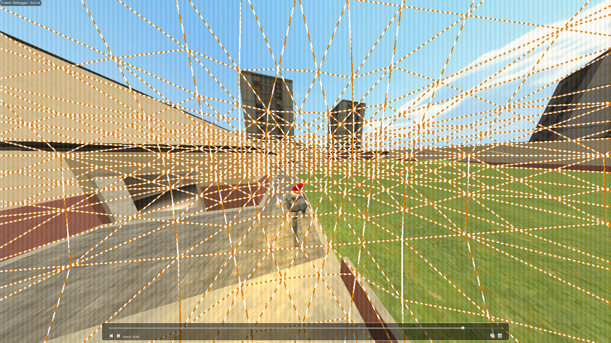
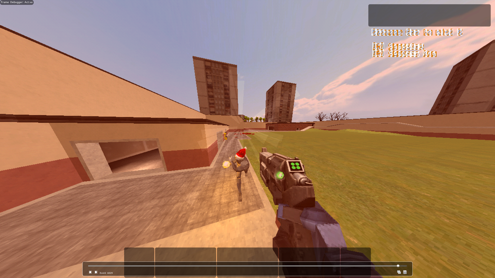

# Захват кадра игры Ultrakill через NVIDIA NSight

Ultrakill написан на Unity3D, из-за чего при отрисовке кадра можно заменить довольно своеобразные вещи.

1. Игра начинает отрисовывать руки игрового персонажа...

чтобы потом скопировать отрисованное в отдельный буффер и отчистить экран

и отрисовать остальную сцену

2. Ряд элементов сцены могут отрисовываться дважды, неправильно накладываясь друг на друга, но корректируя себя под конец, как например со зданием сзади.

3. Красный эффект от урона накладывается не просто как экран, а отрисовывается как красная сфера с учетом объема, в частности для создания динамики удара.

4. Затем идет отрисовка интерфейса вместе с заранее сохраненной рукой. Примичательно, что интерфейс не проходит через шейдер пикселизации для закоса под PS1.

